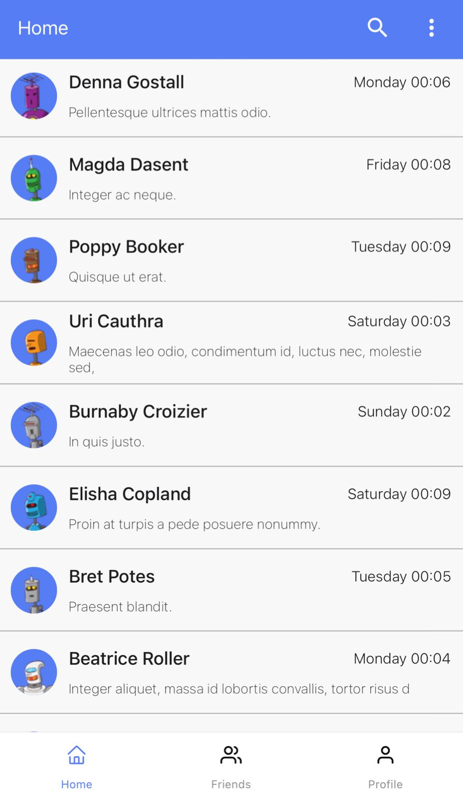
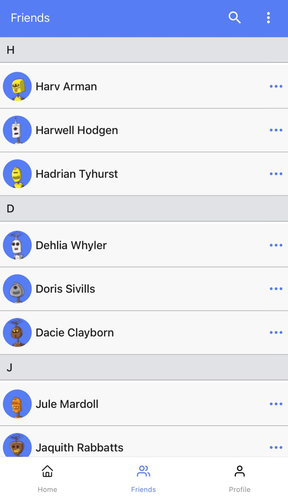
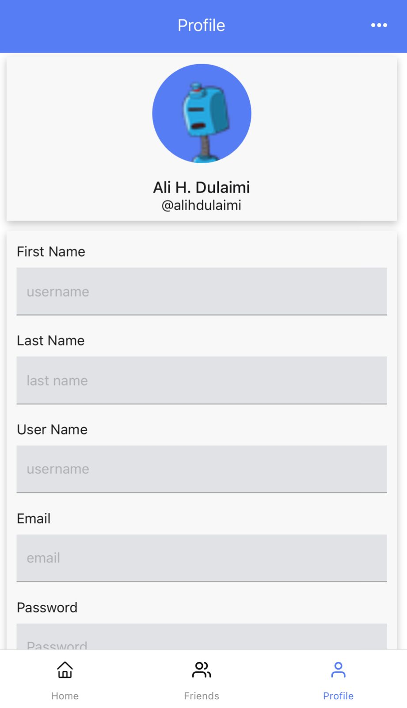

# React-Native-Django-Chat-App [incomplete + ongoing]
A small chat app built using Django and React Native for 1-1 or 1-* chat rooms

  
&nbsp; &nbsp; &nbsp; &nbsp;
  
  

## Technologies in use:
### Django
- Python 3.8
- Channels
- PostgreSQL
- PyTest
- Docker

### App
- React Native
- TypeScript
- Redux && Redux ToolKit && Saga
- Gifted Chat
- Formik && Yup
